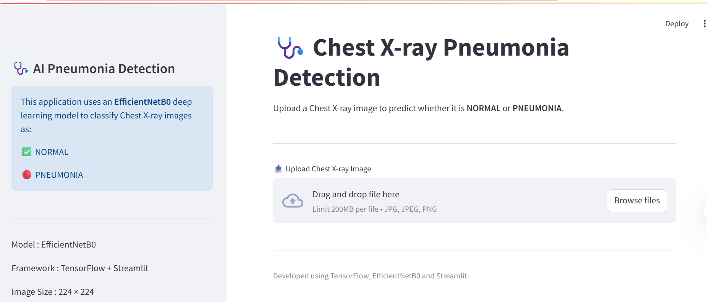
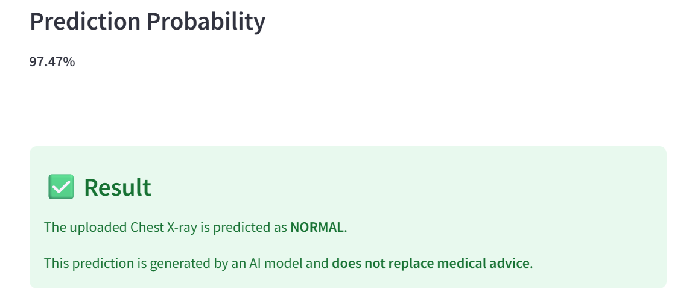
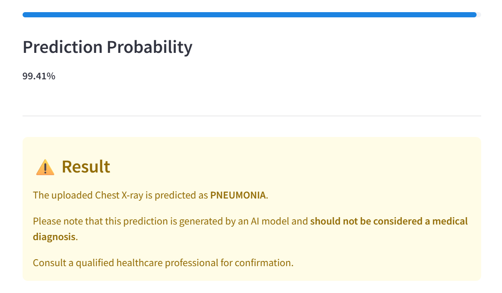

# 🩺 Chest X-ray Pneumonia Detection using Deep Learning

## 📌 Project Overview

This project is an AI-powered web application that detects **Pneumonia** from Chest X-ray images using **EfficientNetB0** and **TensorFlow**.

The model classifies Chest X-ray images into two categories:

- ✅ NORMAL
- 🔴 PNEUMONIA

The application is deployed using **Streamlit**, allowing users to upload a Chest X-ray image and receive a prediction with a confidence score.

---

# 🚀 Features

- Deep Learning-based Chest X-ray Classification
- EfficientNetB0 Transfer Learning Model
- Binary Classification (NORMAL / PNEUMONIA)
- Streamlit Web Application
- Confidence Score Prediction
- User-Friendly Interface
- Real-Time Image Prediction

---

# 📂 Dataset

Dataset Used:

Chest X-ray Pneumonia Dataset

Classes:

- NORMAL
- PNEUMONIA

Image Size:

224 × 224

---

# 🧠 Model Architecture

Transfer Learning Model:

- EfficientNetB0 (ImageNet Weights)

Classification Head:

- GlobalAveragePooling2D
- BatchNormalization
- Dropout
- Dense (128 ReLU)
- BatchNormalization
- Dropout
- Dense (Sigmoid)

---

# ⚙️ Technologies Used

- Python
- TensorFlow
- Keras
- EfficientNetB0
- NumPy
- Pillow (PIL)
- Streamlit

---

# 📊 Model Performance

Test Accuracy:

86.5%

AUC Score:

95.8%

Loss:

0.5239

Precision:

83.26%

Recall:

98.20%

---

# 📁 Project Structure

```
Chest_Xray_Pneumonia_Detection/
│
├── app.py
├── predict.py
├── utils.py
├── gradcam.py
├── labels.json
├── requirements.txt
├── README.md
├── Chest_Xray_Pneumonia_EfficientNetB0.keras
├── images/
└── venv/
```

---

# ▶️ How to Run

## Clone Repository

```bash
git clone <repository-link>
```

## Install Dependencies

```bash
pip install -r requirements.txt
```

## Run Application

```bash
streamlit run app.py
```

---

# 📸 Application Screenshots

### Home Page


---

### NORMAL Prediction




---

### PNEUMONIA Prediction




---

# 📈 Future Improvements

- Grad-CAM Visualization
- PDF Medical Report Generation
- Cloud Deployment
- Multi-Class Disease Classification
- Mobile-Friendly Interface

---

# ⚠️ Disclaimer

This application is developed for **educational and research purposes only**.

It should **not** be used as a replacement for professional medical diagnosis.

---

# 👩‍💻 Developer

Developed by **Sambit Kumar Sahu**
